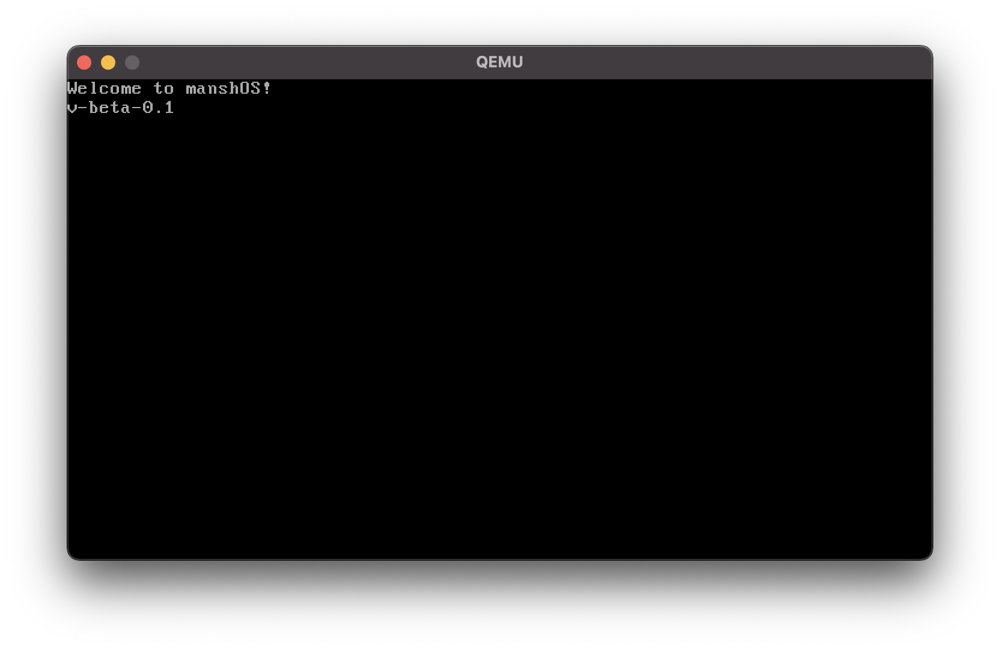
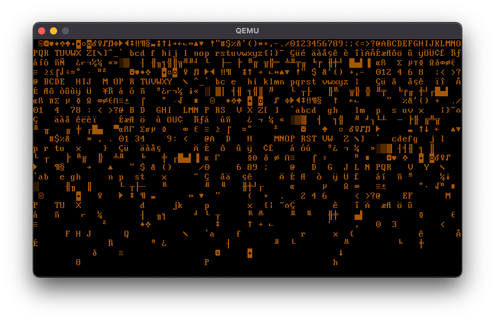
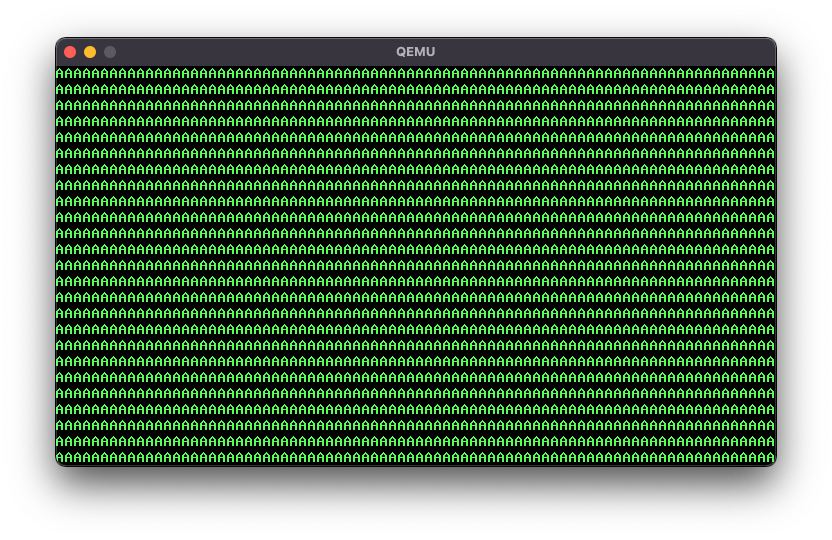
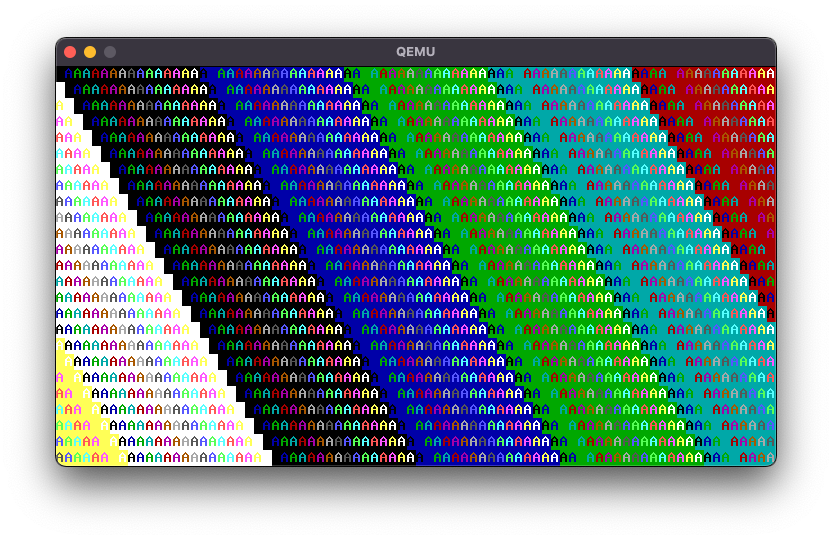
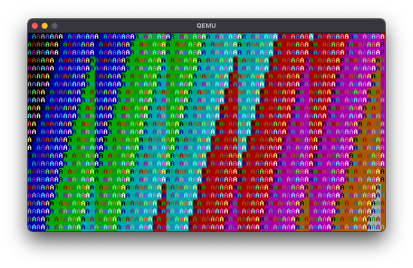
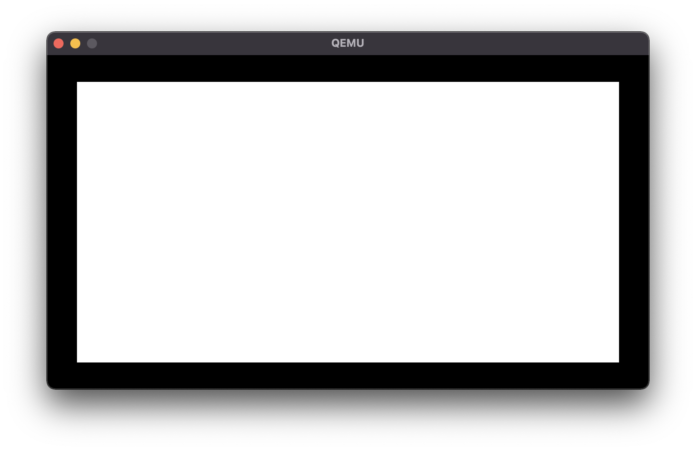
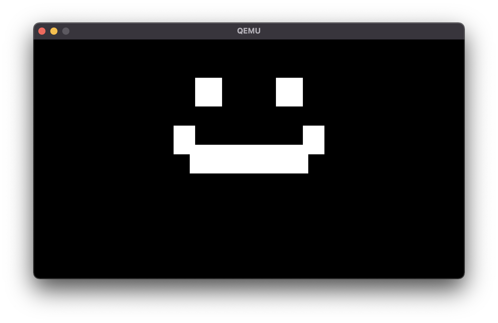
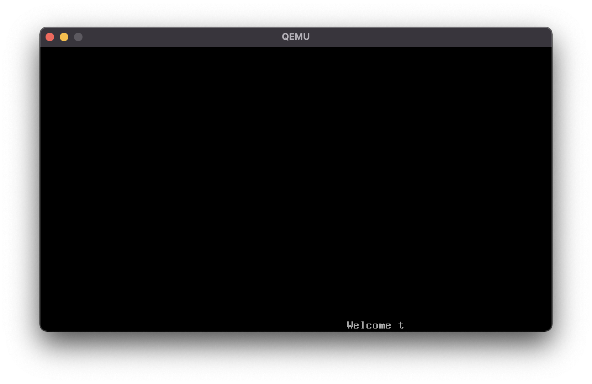

# manshOS # 
### is a simple OS, built completely from scratch. ###
Here you can see it in its current state of development:

## Renderer ##
In attempt 1 of trying to build the renderer, it went as far as printing characters all over the screen, as you can see in the following picture.

Now in attempt 2, I've managed to get the renderer to print on the whole screen. These are just A's but this will be fixed soon.

Due to changing the rendering algorithm for now, you can see that the display has got these beautiful shapes with all those different colors. Now you can see the possibilities this renderer has.

By adding in the inf_render(void) function, we now got a moving picture. This works due to changing the value of the rendering mechanic during runtime. In the following picture, you can see one frame of it.

Now I've added in a function, which renders rectangles between certain points on the screen, as you can see in the following picture.

When using the method multiple times in the inf_render(void) function, you are able to create symbols or pictures, like the smiley in the following picture.

Even though rendering shapes works perfectly fine, rendering text in the inf_render(void) method doesn't work that well yet. If you try it, the text moves really fast and you nearly can't read it as you can see in the following picture.

## Future plans for the project ##
Currently manshOS is just a kernel that prints out text and can compile C Code, but in the near future more updates and functionalities will be added.